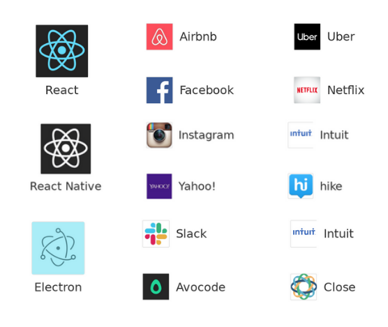

# Projeto Web, Mobile e Desktop



Este repositório organiza o desenvolvimento de projetos para plataformas web, mobile e desktop, estruturado nos seguintes diretórios:

## 📂 Estrutura do Projeto

-   **`0-doc/`**: Contém os documentos necessários para a configuração inicial do projeto, como especificações técnicas, guias de instalação e outros arquivos relacionados.
-   **`1-meu-projeto-html/`**: Projeto baseado em HTML, CSS e JavaScript para desenvolvimento web estático.
-   **`2-meu-projeto-react/`**: Aplicação web desenvolvida com React JS utilizando JavaScript, focada em componentes dinâmicos e interativos.
-   **`3-meu-project-mobile/meu-projeto-mobile/`**: Aplicativo mobile desenvolvido em React Native com Expo, utilizando JavaScript para plataformas Android e iOS.
-   **`4-meu-projeto-electron/`**: Aplicação desktop criada com Electron, permitindo o desenvolvimento de aplicações multiplataforma (Windows, macOS, Linux) usando tecnologias web como JavaScript, HTML e CSS.

---

## 📥 Download

Para baixar o repositório, execute o seguinte comando:

```sh
git clone https://github.com/leonardorsolar/project-web-mobile-desktop.git
```

Ou faça o download diretamente na página do projeto:

🔗 GitHub - leonardorsolar/project-web-mobile-desktop

# ⚙️ Configuração Inicial

Para configurar e executar cada parte do projeto, consulte o diretório 0-doc, onde estão os arquivos start.md com instruções detalhadas para instalação e inicialização.
🔹 Iniciação e Configuração dos Projetos

    Start: Inicialização e configuração geral do repositório.
    Start1: Inicialização do projeto front-end em HTML.
    Start2: Inicialização e configuração do projeto front-end web em ReactJS.
    Start3: Inicialização e configuração do projeto mobile em React Native.
    Start4: Inicialização e configuração do projeto desktop em Electron.

---

Este repositório foi projetado para manter a organização entre diferentes plataformas de desenvolvimento, permitindo a colaboração eficiente e o uso de tecnologias modernas em cada contexto.

```

```
